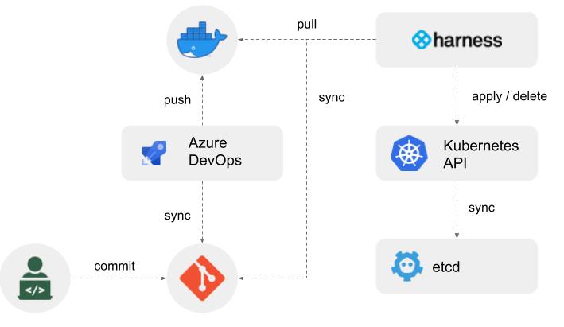

# GitOps Demo Application

## Introduction

GitOps Demo is a simple Spring Boot web application used to demonstrate the [gitops](https://www.gitops.tech/) style of deployment. With GitOps, Git is the single source of truth for application code and for infrastructure.  Everything is managed as code in Git, and everything can be easily re-created, rolled back, and updated.  It is also easy to perform audits on application and infrastructure changes through Git history and revisions.

More information on GitOps is available in the [presentation](./docs/gitops-demo.pdf) in this repository.

## Repository Structure

Since Git is the single source of truth for both application code and infrastructure, the repository contains all of the code for CD pipelines as well as the application.  In addition to the standard Maven project structure, there are additional items in the repository:

- [***.yaml**](./) - Contains the files for the [Azure DevOps](https://azure.microsoft.com/en-us/services/devops/).  This builds the application and Docker image, and deploys the image to DockerHub
- [**Setup**](./Setup) - Contains the files for the [Harness CD Server](https://harness.io).  The Harness server detects a new Docker image and deploys it to an AKS Kubernetes cluster.

## Building and running

If you want to run the application locally, use the standard Maven and Spring Boot goals:

`mvn clean package spring-boot:run`

The application uses an embedded H2 database, so there's no requirements for systems outside of the application.

The index page also displays a few Pod attributes from Kubernetes.  You can mock this up locally by setting the following environment variables before starting:

```bash
export POD_NAME=MyPodName
export POD_NAMESPACE=MyPodNamespace
export POD_IP=MyPodIp
```

## CI/CD flow

The general flow of the CI/CD deployment is as follows:

1. Changes are made on the local development environment.
1. Changes are committed to the Git repository.
1. The Azure DevOps pipeline detects a new commit to the Git repository.
1. The Azure DevOps pipeline gets the updated repository, and builds and tests the application
1. If the tests pass, the branch is merged back into the master branch
1. Another Azure DevOps pipeline detects the change, builds the Docker image, and pushes the Docker image to DockerHub.
1. The Harness application detects the updated Docker image in Docker Hub.
1. The Harness application pulls the new image, and does a rolling deploy to the AKS Kubernetes cluster, creating load balancing services and namespaces if necessary.


